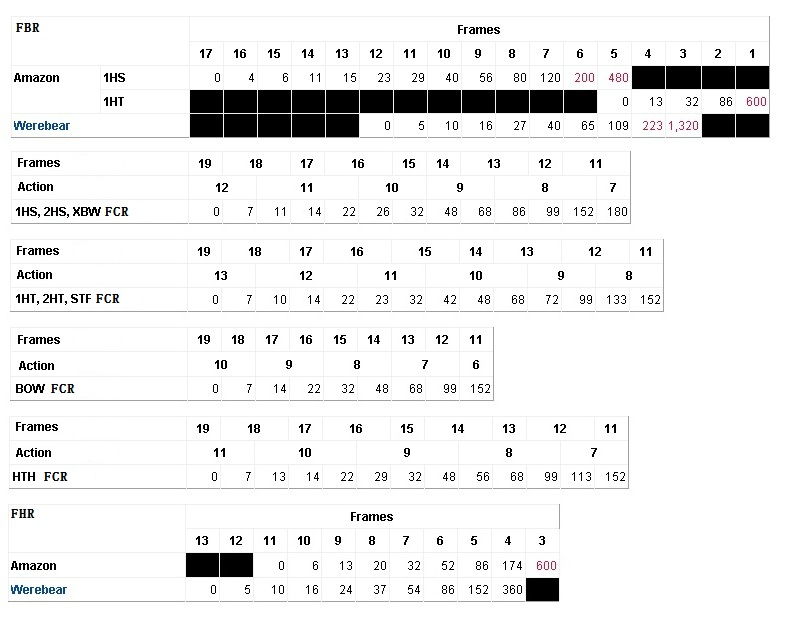
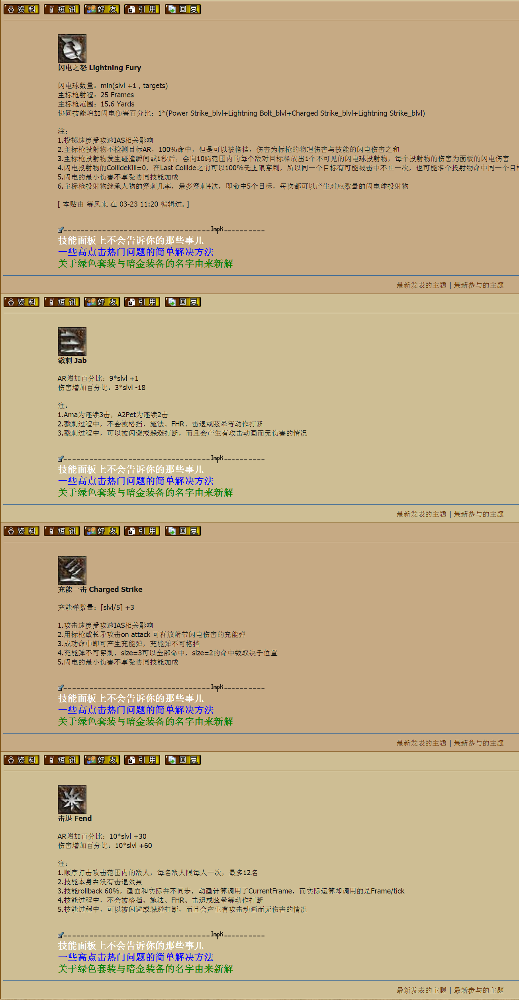
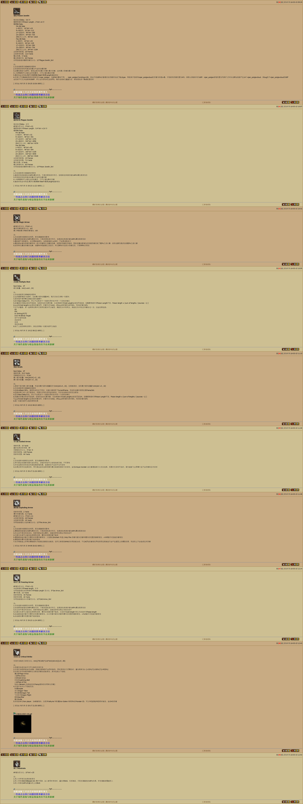
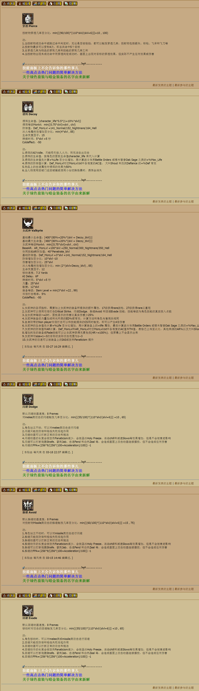

Amazon
===============================================================================
- 闪电之怒 Lightning Fury
- 戳刺 Jab
- 充能一击 Charged Strike
- 击退 Fend
- 毒枪 Poison Javelin
- 瘟疫标枪 Plague Javelin
- 魔法箭 Magic Arrow
- 多重箭 Multiple Shot
- 炮轰 Strafe
- 导引箭 Guided Arrow
- 爆裂箭 Exploding Arrow
- 冻结之箭 Freezing Arrow
- 双倍打击 Critical Strike
- 刺入 Penetrate
- 穿透 Pierce
- 诱饵 Decoy
- 女武神 Valkyrie
- 闪避 Dodge
- 躲避 Avoid
- 回避 Evade

slvl  =  skill level 含装备的技能等级

blvl  =  base level 不含装备的投资点数

火焰箭Fire Arrow 和冰箭Cold Arrow 当技能等级<50时，可以被格挡；当技能等级≥50时，物理伤害100%转化为元素伤害，无法被格挡。

技能详解
-------------------------------------------------------------------------------

