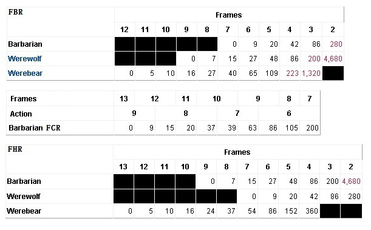
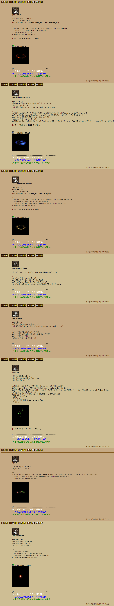
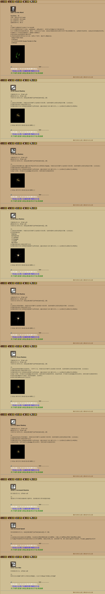
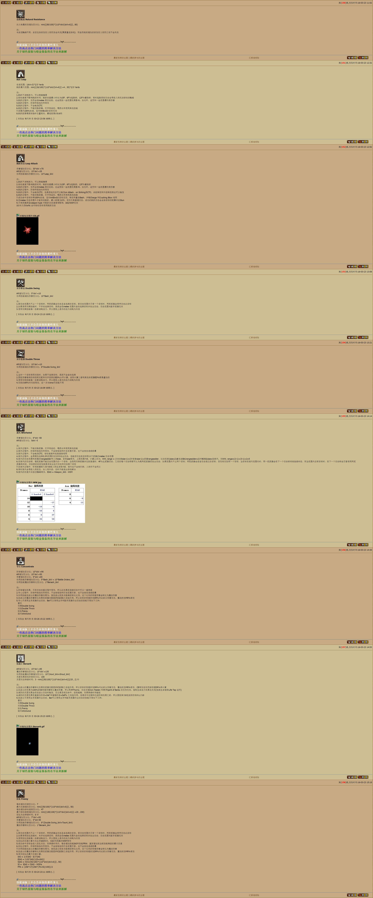

Barbarian
===============================================================================
- 大叫 Shout
- 战斗体制 Battle Orders
- 战斗指挥 Battle Command
- 找寻物品 Find Item
- 战斗狂嗥 War Cry
- 狂嗥 Howl
- 嘲弄 Taunt
- 战嗥 Battle Cry
- 残酷吓阻 Grim Ward
- 剑支配 Sword Mastery
- 斧支配 Axe Mastery
- 杖支配 Mace Mastery
- 长柄支配 Pole Mastery
- 投掷支配 Throw Mastery
- 枪矛支配 Spear Mastery
- 增加耐力 Increased Stamina
- 加速 Increased Speed
- 铁布衫 Iron Skin
- 自然抵抗 Natural Resistance
- 跳跃 Leap
- 跳跃攻击 Leap Attack
- 双手挥击 Double Swing
- 双手投掷 Double Throw
- 旋风 Whirlwind
- 专心 Concentrate
- 狂战士 Berserk
- 狂乱 Frenzy

slvl  =  skill level 含装备的技能等级

blvl  =  base level 不含装备的投资点数

旋风Whirlwind 在1.10/1.11相对于1.09，升级了部分代码算法

技能详解
-------------------------------------------------------------------------------

