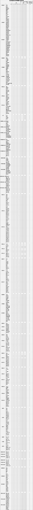

.. _物品的孔数:

物品的孔数
===============================================================================

Normal item （白色物品）的最大孔数。
-------------------------------------------------------------------------------
Normal item上的最大孔数由物品类型和物品种类两者共同决定。（例如，Composite bow的物品类型是bow，它的物品种类是Composite bow. Short sword 的物品类型是sword，其物品总类为short sword，诸如此类）

具体如何决定呢，首先，物品类型决定物品在不同ilvl下的最大孔数。 例如Composite bow，它的物品类型是bow。 而bow的最大孔数规则为：当其ilvl为1-24时，其最大孔数为3，当其ilvl为25-39时，其最大孔数为4，当其ilvl为40-99时，其最大孔数为6。 然后，物品种类将决定该物品实际可能出现的最大孔数。 仍旧以Composite bow为例子，它的物品种类就是Composite bow，这决定了其最大孔数为4。 因此，最后，Composite bow的实际出现孔数为：当其ilvl为1-24时，其最大孔数为3，当其ilvl为25-39时，其最大孔数为4，当其ilvl为40-99时，其最大孔数为4。 注：物品的实际最大空数还受到物品体积的限制，且最大不能超过６

1) normal 物品上天然孔数。

Normal物品是个总称，实际上它是Superior,Normal,Lowquality （实际上Lowquality 也是Crude,Cracked,Damaged,Low Quality四种物品的总称）物品的总称。其中只有Superior,Normal这两种物品可能具有天然的孔数。天然形成的孔数的最大值依然由物品类型和物品种类两者共同决定，过程就如上了.天然形成的孔数为(1——最大孔数)随机取值.

2) act5的打孔任务.

act5任务对于normal item总能打出当前ilvl下的最大孔数.例如,一个ilvl=20的Composite bow就一能打出3s.诸如此类.

3) 110中新的打孔公式.

110的打孔公式仅仅适用于normal item,而不能对Superior和Lowquality 两种物品进行打孔(实际上Lowquality 物品一般情况下也没必要打孔). 打出的孔数都是随机的,并且孔数的最大值仍旧由物品类型和物品种类两者共同决定.

Magic item (蓝色物品)
-------------------------------------------------------------------------------
事实上magic item和normal item一样也由物品类型决定物品在不同ilvl下的最大孔数.

1) 词缀修饰得到的孔数

mgaic item可以由词缀修饰得到孔数.但是这里需要注意,我在109后期提到的一个原则到了110仍然有效,这就是当物品最大孔数与词缀修饰的孔数出现矛盾的时候,一定会出现两者之间较小者.(例如,一件mage plate,其物品最大孔数为3,当它被Jeweler's这个词缀修饰的时候,最后你会发现它是3s,而不是应当出现的4s)

2) 3cg 公式和110中的新magci item cube

3s sword是09种3cg+sword公式风行后的遗留品,例如著名的ccbq.不过实际上并不是所有s cg公式都得到3s. 当物品最大孔数<3时,即使用3cg公式也只能得到其最大孔数.例如用bone knife仅能得到1s.同理适用于新magci item cube。这里还将遵循的原则是当物品最大孔数与词缀修饰的孔数和打孔随机出现孔数出现矛盾的时候,一定会出现三者之间较小者。

3) act5的打孔任务.

对于magic 物品来说,用act5的打孔任务来打孔会随机出现1-2s,这个几率是平均的,而且在normal,nightmare和hell下都是一样的,没有分别.需要注意的是,和由词缀修饰类似的,当物品最大孔数与打孔孔数出现矛盾的时候,一定会出现两者之间较小者. 例如,用一把magic 的bone knife去打孔,无论如何也只能出现1s,这就是由于bone knife本身只能有1s的关系.

rare item (亮金色物品)
-------------------------------------------------------------------------------
rare item和normal item一样也由物品类型决定物品在不同ilvl下的最大孔数.

1) 词缀修饰的得到的孔数.

同magic item一样,rare item可以由词缀修饰得到孔数.但是这里需要注意的就是是当物品最大孔数与词缀修饰的孔数出现矛盾的时候,一定会出现两者之间较小者.(例如,一把rare bone knife,其物品最大孔数为1,当它被Mechanic's这个词缀修饰的时候即使随机出现了2s,但最后其孔数仍旧为1s,这是由于bone knife本身只能有1s的关系.)

2) soj 打孔公式

只能出1s,没设么好说的了.

3) act5的打孔任务.

也只能出1s,还是没设么好说的了.

set item( 绿色套装)
-------------------------------------------------------------------------------
set item和normal item一样也由物品类型决定物品在不同ilvl下的最大孔数.

1) 天然形成的孔数

set item里有不少本身带有孔数的,例如著名的Griswold's Legacy套装,全身上下最多可有12s.
一些set item的孔数还是随即的,例如Natalya's Shadow,可以随机出现1-3s.

2) act5的打孔任务.

对于set 物品而言,这任务可以赋予1s.当然已经有孔的就不能重复打了.

unique item
-------------------------------------------------------------------------------
情况基本和set item一样,不再赘述了.

craft item
-------------------------------------------------------------------------------
Craft item类同于rare item的情况.

对于打孔公式的补充说明
-------------------------------------------------------------------------------
公式定义中会随机选择1~6孔(不论被打孔的物品是武器或防具)

选取这6种孔数的几率都是1/6

然后再由下面表格中的最大孔数限制来决定产物最终的孔数

如果超过物品自身的孔数限制,那么产物孔数取其最大值.

这里举两个例子:

1. 一把ilvl=6普通的短弓，查其最大孔数为3。
应用公式[ 1 Ral(8#) + 1 Amn(11#) + 1 完美紫宝石 + 普通武器 = 同类型带孔武器 ]打孔时，选取3-6孔都将出现3孔。
那么实际出孔的概率为：1孔 1/6；2孔 1/6；3孔 2/3。

2. 一件ilvl=81普通的执政官铠甲，查其最大孔数为4。
应用公式[ 1 Tal(7#) + 1 Thul(10#) + 1 完美黄宝石 + 普通盔甲 = 同类型带孔盔甲 ]打孔时，选取4-6孔都将出现4孔。
那么实际出孔的概率为：1孔 1/6；2孔 1/6；3孔 1/6；4孔 1/2。

