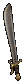
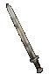

剑
==============================================================================

.. contents::
    :local:

普通
------------------------------------------------------------------------------

单手
~~~~~~~~~~~~~~~~~~~~~~~~~~~~~~~~~~~~~~~~~~~~~~~~~~~~~~~~~~~~~~~~~~~~~~~~~~~~~~

.. _短剑-Short-Sword:

短剑 (Short Sword)
++++++++++++++++
.. image:: ./images/短剑-(Short-Sword).png

- 套装: -
- 暗金: 瑞克撒特的挽歌

.. code-block:: 

    单手伤害:2-7
    范围:1
    武器基础攻速:[0]
    需求力量:-
    需求敏捷:-
    耐久度:24
    最大孔数:2
    品质等级:1
    需要等级：-

.. _弯刀-Scimitar:

弯刀 (Scimitar)
+++++++++++++
.. image:: ./images/弯刀-(Scimitar).png

- 套装: -
- 暗金: 血红新月

.. code-block:: 

    单手伤害:2-6
    范围:1
    武器基础攻速:[-20]
    需求力量:-
    需求敏捷:21
    耐久度:22
    最大孔数:2
    品质等级:5
    需要等级：-

.. _军刀-Sabre:

军刀 (Sabre)
++++++++++
.. image:: ./images/军刀-(Sabre).png

- 套装: 天使的镰刀
- 暗金: 格林提斯的肉叉

.. code-block:: 

    单手伤害:3-8
    范围:1
    武器基础攻速:[-10]
    需求力量:25
    需求敏捷:25
    耐久度:32
    最大孔数:2
    品质等级:8
    需要等级：-

.. _弯形大刀-Falchion:

弯形大刀 (Falchion)
+++++++++++++++

- 套装: -
- 暗金: 闪耀的镰刀

.. code-block:: 

    单手伤害:9-17
    范围:1
    武器基础攻速:[20]
    需求力量:33
    需求敏捷:-
    耐久度:32
    最大孔数:2
    品质等级:11
    需要等级：-

.. _水晶剑-Crystal-Sword:

水晶剑 (Crystal Sword)
+++++++++++++++++++

- 套装: -
- 暗金: -

.. code-block:: 

    单手伤害:5-15
    范围:2
    武器基础攻速:[0]
    需求力量:43
    需求敏捷:-
    耐久度:20
    最大孔数:6
    品质等级:11
    需要等级：-

.. _阔剑-Broad-Sword:

阔剑 (Broad Sword)
++++++++++++++++

- 套装: 依森哈德的光之烙铁
- 暗金: 格瑞斯华尔德的锐利

.. code-block:: 

    单手伤害:7-14
    范围:1
    武器基础攻速:[0]
    需求力量:48
    需求敏捷:-
    耐久度:32
    最大孔数:4
    品质等级:15
    需要等级：-

.. _长剑-Long-Sword:

长剑 (Long Sword)
+++++++++++++++
.. image:: ./images/长剑-(Long-Sword).png

- 套装: 克雷得劳之牙
- 暗金: 地狱瘟疫

.. code-block:: 

    单手伤害:3-19
    范围:1
    武器基础攻速:[-10]
    需求力量:55
    需求敏捷:39
    耐久度:24
    最大孔数:4
    品质等级:20
    需要等级：-

.. _巨战之剑-War-Sword:

巨战之剑 (War Sword)
++++++++++++++++
.. image:: ./images/巨战之剑-(War-Sword).png

- 套装: 死亡之触
- 暗金: 库尔温的尖端

.. code-block:: 

    单手伤害:8-20
    范围:1
    武器基础攻速:[0]
    需求力量:71
    需求敏捷:45
    耐久度:44
    最大孔数:3
    品质等级:27
    需要等级：-

双手
~~~~~~~~~~~~~~~~~~~~~~~~~~~~~~~~~~~~~~~~~~~~~~~~~~~~~~~~~~~~~~~~~~~~~~~~~~~~~~

.. _双手剑-Two-handed-Sword:

双手剑 (Two-handed Sword)
++++++++++++++++++++++
.. image:: ./images/双手剑-(Two-handed-Sword).png

- 套装: -
- 暗金: 影之牙

.. code-block:: 

    单手伤害:2-9
    双手伤害:8-17
    范围:3
    武器基础攻速:[0]
    需求力量:35
    需求敏捷:27
    耐久度:44
    最大孔数:3
    品质等级:10
    需要等级：-

.. _双刃大刀-Claymore:

双刃大刀 (Claymore)
+++++++++++++++

- 套装: -
- 暗金: 剥皮灵魂

.. code-block:: 

    单手伤害:5-12
    双手伤害:13-30
    范围:3
    武器基础攻速:[10]
    需求力量:47
    需求敏捷:-
    耐久度:50
    最大孔数:4
    品质等级:17
    需要等级：-

.. _大剑-Giant-Sword:

大剑 (Giant Sword)
++++++++++++++++

- 套装: -
- 暗金: 金麦尔的锥子

.. code-block:: 

    单手伤害:3-16
    双手伤害:9-28
    范围:3
    武器基础攻速: [0]
    需求力量:56
    需求敏捷:34
    耐久度:50
    最大孔数:4
    品质等级:21
    需要等级：-

.. _巨剑-Bastard-Sword:

巨剑 (Bastard Sword)
++++++++++++++++++

- 套装: -
- 暗金: 黑色之舌

.. code-block:: 

    单手伤害:7-19
    双手伤害:20-28
    范围:2
    武器基础攻速: [10]
    需求力量:62
    需求敏捷:-
    耐久度:40
    最大孔 数:4
    品质等级:24
    需要等级：-

.. _双手饰剑-Flamberge:

双手饰剑 (Flamberge)
++++++++++++++++

- 套装: -
- 暗金: 粗齿大锯

.. code-block:: 

    单手伤害:9-15
    双手伤害:13-26
    范围:3
    武器基础攻速: [-10]
    需求力量:70
    需求敏捷:49
    耐久度:50
    最大孔数:5
    品质等级:27
    需要等级：-

.. _卓越之剑-Great-Sword:

卓越之剑 (Great Sword)
++++++++++++++++++
.. image:: ./images/卓越之剑-(Great-Sword).png

- 套装: -
- 暗金: 族长

.. code-block:: 

    单手伤害:12-20
    双手伤害:25-42
    范围:3
    武器基础攻速: [10]
    需求力量:100
    需求敏捷:60
    耐久度:50
    最大孔数:6
    品质等级:33
    需要等级：-

扩展
------------------------------------------------------------------------------

单手
~~~~~~~~~~~~~~~~~~~~~~~~~~~~~~~~~~~~~~~~~~~~~~~~~~~~~~~~~~~~~~~~~~~~~~~~~~~~~~

.. _罗马短剑-Gladius:

罗马短剑 (Gladius)
++++++++++++++

- 套装: -
- 暗金: 血书

.. code-block:: 

    单手伤害:8-22
    范围:1
    武器基础攻速:[0]
    需求力量:25
    需求敏捷:-
    耐久度:24
    最大孔数:2
    品质等级:30
    需要等级：18

.. _微弯剑-Cutlass:

微弯剑 (Cutlass)
+++++++++++++
.. image:: ./images/微弯剑-(Cutlass).png

- 套装: -
- 暗金: 冰刚之眼

.. code-block:: 

    单手伤害:8-21
    范围:1
    武器基础攻速:[-30]
    需求力量:25
    需求敏捷:52
    耐久度:22
    最大孔数:2
    品质等级:43
    需要等级：25

.. _虚伪之刃-Shamshir:

虚伪之刃 (Shamshir)
+++++++++++++++
.. image:: ./images/虚伪之刃-(Shamshir).png

- 套装: -
- 暗金: 六角之火

.. code-block:: 

    单手伤害:10-24
    范围:1
    武器基础攻速:[-10]
    需求力量:58
    需求敏捷:58
    耐久度:32
    最大孔数:2
    品质等级:35
    需要等级：23

.. _圆月弯刀-Tulwar:

圆月弯刀 (Tulwar)
+++++++++++++
.. image:: ./images/圆月弯刀-(Tulwar).png

- 套装: -
- 暗金: 阿里巴巴之刃

.. code-block:: 

    单手伤害:16-35
    范围:1
    武器基础攻速:[20]
    需求力量:70
    需求敏捷:42
    耐久度:32
    最大孔数:2
    品质等级:37
    需要等级：25

.. _空间之刃-Dimensional-Blade:

空间之刃 (Dimensional Blade)
++++++++++++++++++++++++
.. image:: ./images/空间之刃-(Dimensional-Blade).png

- 套装: -
- 暗金: 金瑟的裂缝

.. code-block:: 

    单手伤害:13-35
    范围:2
    武器基础攻速:[0]
    需求力量:85
    需求敏捷:60
    耐久度:20
    最大孔数:6
    品质等级:37
    需要等级：25

.. _战斗剑-Battle-Sword:

战斗剑 (Battle Sword)
++++++++++++++++++
.. image:: ./images/战斗剑-(Battle-Sword).png

- 套装: -
- 暗金: 击头者

.. code-block:: 

    单手伤害:16-34
    范围:1
    武器基础攻速:[0]
    需求力量:92
    需求敏捷:43
    耐久度:32
    最大孔数:4
    品质等级:40
    需要等级：25

.. _符文剑-Rune-Sword:

符文剑 (Rune Sword)
++++++++++++++++
.. image:: ./images/符文剑-(Rune-Sword).png

- 套装: -
- 暗金: 疫病带原者

.. code-block:: 

    单手伤害:10-42
    范围:1
    武器基础攻速:[-10]
    需求力量:103
     需求敏捷:79
    耐久度:44
    最大孔数:4
    品质等级:44
    需要等级：25

.. _古代之剑-Ancient-Sword:

古代之剑 (Ancient Sword)
++++++++++++++++++++
.. image:: ./images/古代之剑-(Ancient-Sword).png

- 套装: -
- 暗金: 亚特拉斯

.. code-block:: 

    单手伤害:18-43
    范围:1
    武器基础攻速:[0]
    需求力量:127
    需求敏捷:88
    耐久度:44
    最大孔数:3
    品质等级:49
    需要等级：25

双手
~~~~~~~~~~~~~~~~~~~~~~~~~~~~~~~~~~~~~~~~~~~~~~~~~~~~~~~~~~~~~~~~~~~~~~~~~~~~~~

.. _斩铁剑-Espandon:

斩铁剑 (Espandon)
++++++++++++++

- 套装: -
- 暗金: 克林铁 弗姆

.. code-block:: 

    单手伤害:8-26
    双手伤害:18-40
    范围:3
    武器基础攻速:[0]
    需求力量:73
    需求敏捷:61
    耐久度:44
    最大孔数:3
    品质等级:37
    需要等级：25

.. _双刃镰-Dacian-Falx:

双刃镰 (Dacian Falx)
+++++++++++++++++
.. image:: ./images/双刃镰-(Dacian-Falx).png

- 套装: -
- 暗金: 兵之王

.. code-block:: 

    单手伤害:13-30
    双手伤害:26-61
    范围:3
    武器基础攻速: [10]
    需求力量:91
    需求敏捷:20
    耐久度:50
    最大孔数:4
    品质等级:42
    需要等级：25

.. _长牙剑-Tusk-Sword:

长牙剑 (Tusk Sword)
++++++++++++++++
.. image:: ./images/长牙剑-(Tusk-Sword).png

- 套装: -
- 暗金: 卑劣躯壳

.. code-block:: 

    单手伤害:10-37
    双手伤害:19-58
    范围:3
    武器基础攻速:  [0]
    需求力量:104
    需求敏捷:71
    耐久度:50
    最大孔数:4
    品质等级:45
    需要等级：25

.. _歌德剑-Gothic-Sword:

歌德剑 (Gothic Sword)
++++++++++++++++++
.. image:: ./images/歌德剑-(Gothic-Sword).png

- 套装: -
- 暗金: 云裂

.. code-block:: 

    单手伤害:14-40
    双手伤害:39-60
    范围:2
    武器基础攻速:  [10]
    需求力量:113
    需求敏捷:20
    耐久度:40
    最大孔数:4
    品质等级:48
    需要等级：25

.. _瑞韩德之剑-Zweihander:

瑞韩德之剑 (Zweihander)
++++++++++++++++++
.. image:: ./images/瑞韩德之剑-(Zweihander).png

- 套装: -
- 暗金: 特迪斯法雷.芙法米

.. code-block:: 

    单手伤害:19-35
    双手伤害:29-54
    范围:3
    武器基础攻速:  [-10]
    需求力量:125
    需求敏捷:94
    耐久度:50
    最大孔数:5
    品质等级:49
    需要等级：25

.. _死刑之剑-Executioner-Sword:

死刑之剑 (Executioner Sword)
++++++++++++++++++++++++
.. image:: ./images/死刑之剑-(Executioner-Sword).png

- 套装: -
- 暗金: 剑卫

.. code-block:: 

    单手伤害:24-40
    双手伤害:47-80
    范围:3
    武器基础攻速:  [10]
    需求力量:170
    需求敏捷:110
    耐久度:50
    最大孔数:6
    品质等级:54
    需要等级：25

精华
------------------------------------------------------------------------------

单手
~~~~~~~~~~~~~~~~~~~~~~~~~~~~~~~~~~~~~~~~~~~~~~~~~~~~~~~~~~~~~~~~~~~~~~~~~~~~~~

.. _刃剑-Falcata:

刃剑 (Falcata)
++++++++++++
.. image:: ./images/刃剑-(Falcata).png

- 套装: -
- 暗金: -

.. code-block:: 

    单手伤害:31-59
    范围:1
    武器基础攻速:[0]
    需求力量:150
    需求敏捷:88
    耐久度:24
    最大孔数:2
    品质等级:56
    需要等级：42

.. _土耳其剑-Ataghan:

土耳其剑 (Ataghan)
++++++++++++++

- 套装: -
- 暗金: 迪•金杀手

.. code-block:: 

    单手伤害:26-46
    范围:1
    武器基础攻速:[-20]
    需求力量:135
    需求敏捷:95
    耐久度:22
    最大孔数:2
    品质等级:61
    需要等级：45

.. _优雅之剑-Elegant-Blade:

优雅之剑 (Elegant Blade)
++++++++++++++++++++

- 套装: -
- 暗金: 血月

.. code-block:: 

    单手伤害:33-45
    范围:1
    武器基础攻速:[-10]
    需求力量:109
    需求敏捷:122
    耐久度:32
    最大孔数:2
    品质等级:63
    需要等级：47

.. _九头蛇刃-Hydra-Edge:

九头蛇刃 (Hydra Edge)
+++++++++++++++++
.. image:: ./images/九头蛇刃-(Hydra-Edge).png

- 套装: -
- 暗金: -

.. code-block:: 

    单手伤害:28-68
    范围:1
    武器基础攻速:[10]
    需求力量:142
    需求敏捷:105
    耐久度:32
    最大孔数:2
    品质等级:69
    需要等级：51

.. _幻化之刃-Phase-Blade:

幻化之刃 (Phase Blade)
++++++++++++++++++
.. image:: ./images/幻化之刃-(Phase-Blade).png

- 套装: -
- 暗金: 光之军刀，青色愤怒

.. code-block:: 

    单手伤害:31-35
    范围:2
    武器基础攻速:[-30]
    需求力量:25
    需求敏捷:136
    耐久度:-
    最大孔数:6
    品质等级:73
    需要等级：54

.. _征服之剑-Conquest-Sword:

征服之剑 (Conquest Sword)
+++++++++++++++++++++
.. image:: ./images/征服之剑-(Conquest-Sword).png

- 套装: -
- 暗金: -

.. code-block:: 

    单手伤害:37-53
    范围:1
    武器基础攻速:[0]
    需求力量:142
    需求敏捷:112
    耐久度:32
    最大孔数:4
    品质等级:78
    需要等级：58

.. _神秘之剑-Cryptic-Sword:

神秘之剑 (Cryptic Sword)
++++++++++++++++++++

- 套装: 沙撒璧歉悔之钴
- 暗金: 霜风

.. code-block:: 

    单手伤害:5-77
    范围:2
    武器基础攻速:[-10]
    需求力量:99
     需求敏捷:109
    耐久度:24
    最大孔数:4
    品质等级:82
    需要等级：61

.. _秘仪之剑-Mythical-Sword:

秘仪之剑 (Mythical Sword)
+++++++++++++++++++++

- 套装: 布尔凯索的部族守护
- 暗金: -

.. code-block:: 

    单手伤害:40-50
    范围:2
    武器基础攻速:[0]
    需求力量:147
    需求敏捷:124
    耐久度:44
    最大孔数:3
    品质等级:85
    需要等级：66

双手
~~~~~~~~~~~~~~~~~~~~~~~~~~~~~~~~~~~~~~~~~~~~~~~~~~~~~~~~~~~~~~~~~~~~~~~~~~~~~~

.. _传说之剑-Legend-Sword:

传说之剑 (Legend Sword)
+++++++++++++++++++
.. image:: ./images/传说之剑-(Legend-Sword).png

- 套装: -
- 暗金: -

.. code-block:: 

    单手伤害:22-56
    双手伤害:50-94
    范围:3
    武器基础攻速:[-15]
    需求力量:175
    需求敏捷:100
    耐久度:44
    最大孔数:3
    品质等级:59
    需要等级：44

.. _高地之剑-Highland-Blade:

高地之剑 (Highland Blade)
+++++++++++++++++++++
.. image:: ./images/高地之剑-(Highland-Blade).png

- 套装: -
- 暗金: -

.. code-block:: 

    单手伤害:22-62
    双手伤害:67-96
    范围:3
    武器基础攻速: [-5]
    需求力量:171
    需求敏捷:104
    耐久度:100
    最大孔数:4
    品质等级:66
    需要等级：49

.. _炎魔之刃-Balrog-Blade:

炎魔之刃 (Balrog Blade)
+++++++++++++++++++
.. image:: ./images/炎魔之刃-(Balrog-Blade).png

- 套装: -
- 暗金: 火焰怒吼

.. code-block:: 

    单手伤害:15-75
    双手伤害:55-118
    范围:3
    武器基础攻速: [0]
    需求力量:185
    需求敏捷:87
    耐久度:50
    最大孔数:4
    品质等级:71
    需要等级：53

.. _冠军之剑-Champion-Sword:

冠军之剑 (Champion Sword)
+++++++++++++++++++++
.. image:: ./images/冠军之剑-(Champion-Sword).png

- 套装: -
- 暗金: 末日毁灭者

.. code-block:: 

    单手伤害:24-54
    双手伤害:71-83
    范围:3
    武器基础攻速:[-10]
    需求力量:163
    需求敏捷:103
    耐久度:40
    最大孔数:4
    品质等级:77
    需要等级：57

.. _巨神之剑-Colossus-Sword:

巨神之剑 (Colossus Sword)
+++++++++++++++++++++
.. image:: ./images/巨神之剑-(Colossus-Sword).png

- 套装: -
- 暗金: -

.. code-block:: 

    单手伤害:26-70
    双手伤害:61-121
    范围:3
    武器基础攻速:[10]
    需求力量:182
    需求敏捷:95
    耐久度:50
    最大孔数:5
    品质等级:80
    需要等级：60

.. _巨神之刃-Colossus-Blade:

巨神之刃 (Colossus Blade)
+++++++++++++++++++++

- 套装: 布尔凯索的神圣代价
- 暗金: 祖父

.. code-block:: 

    单手伤害:25-65
    双手伤害:58-115
    范围:3
    武器基础攻速:[5]
    需求力量:189
    需求敏捷:110
    耐久度:50
    最大孔数:6
    品质等级:85
    需要等级：63