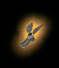
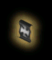
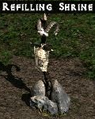
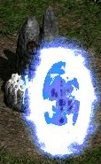
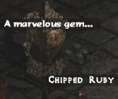
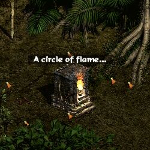
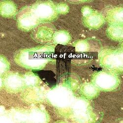
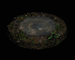

.. _神殿效果一览:

神殿效果一览
==========================================================================
**装甲神殿**

::

    增加100%防御.
    持续时间:96秒.
    再生时间:5分钟.

**战斗神殿**

::

    增加200%ar(注),200%伤害.
    持续时间:96秒.
    再生时间:5分钟.

**抵抗火焰/闪电/冰冷/毒素神殿**

::

    +75%单项抗性.抗毒素神殿能让玩家不再中毒(但如果已中毒,抗毒素神殿不会为你解毒).
    持续时间:144秒.
    再生时间:5分钟.

**技能神殿**

::

    +2到所有技能.
    持续时间:96秒.
    再生时间:5分钟.

**法力回复神殿**

::

    +400%法力回复.
    持续时间:96秒.
    再生时间:5分钟.

**耐力神殿**

::

    无限耐力.
    持续时间:192秒.
    再生时间:5分钟.

**经验神殿**

::

    +50%经验获得.
    持续时间:144秒.
    不会再生.

以下神殿没有固定形态

**回复神殿/生命神殿/法力神殿**

::

    回复 生命和法力/仅生命/仅法力 到满值.
    再生时间:2分钟.

**传送神殿**

::

    打开一个可以无限使用的传送门.
    持续到游戏结束.
    不会再生.

**宝石神殿**

::

    随机升级身上的一个未满级宝石;若身上没有宝石或只有完美的宝石,则掉出个最低级的.
    不会再生.

**火焰神殿**

::

    发射火球,附近的怪物和玩家损失一半生命.
    不会再生.

**怪物神殿**

::

    离神殿最近的一个怪物变成unique级.
    不会再生.

**爆裂/毒素神殿**

::

    掉出5-10个对应的瓶子,并引发大范围爆炸/毒雾.
    不会再生.

**井**

::

    回复自己一半的生命、法力、耐力,回复佣兵、召唤物的全部生命,并为自己和佣兵、召唤物解除中毒和诅咒状态.
    可连续使用两次.
    井的再生很快.

注:

战斗神殿的ar计算有bug,实际计算过程如下:

代码::

    AR = ((Base AR + Direct AR Bonuses) x (1 + Attack Rating Bonuses / 100)) x (1 + (1 + AR bonuses / 100) x (combat boost AR bonus / 100)) + (to hit factor) x (1 + AR bonuses / 100) x (combat boost AR bonus / 100)

说明:

1. ``Base AR = (Dexterity x 5) - 35 + To Hit Factor``
2. combat boost AR bonus=200(神殿对AR的200%加成),这个bonus不是简单的算在AR bonuses里面之一,在最终计算中神殿加成对之前的总bonuses作了加成,以之前总的AR作为基础bass AR再次进行运算,另外还对计算之后的to hit factor也做了bonus修正.
3. AR bonuses/100，这里不包括Attack Skill(攻击技能)上提供的AR%即如Ama的Jab/Impale等，Pal的Charge/Vengeance/Zeal等，Bar的WW/Berserk等
4. 所有计算结果向下取整
