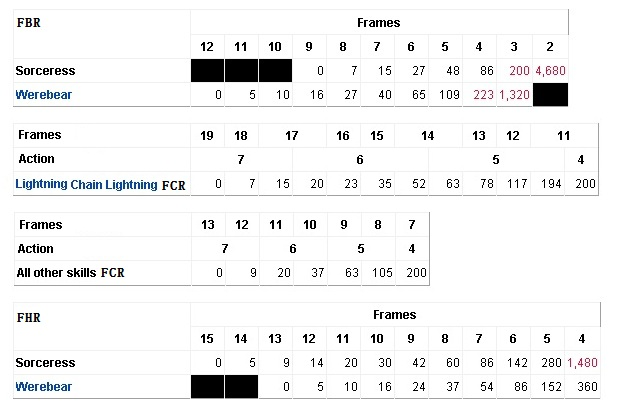
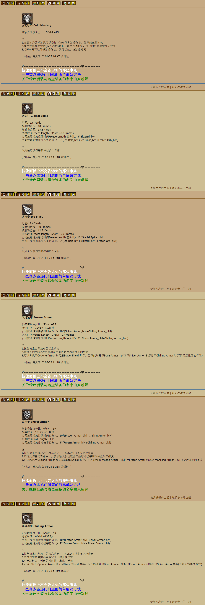

Sorceress
===============================================================================
- 心灵传动 Telekinesis
- 静态力场 Static Field
- 瞬间移动 Teleport
- 雷云风暴 Thunder Storm
- 能量护盾 Energy Shield
- 新星 Nova
- 充能弹 Charged Bolt
- 支配闪电 Lightning Mastery
- 连锁闪电 Chain Lightning
- 闪电 Lightning
- 火球 Fireball
- 温暖 Warmth
- 陨石 Meteor
- 火焰强化 Enchant
- 支配火焰 Fire Mastery
- 火墙 Fire Wall
- 九头海蛇 Hydra
- 暴风雪 Blizzard
- 冰封球 Frozen Orb
- 霜之新星 Frost Nova
- 支配冰冷 Cold Mastery
- 冰尖柱 Glacial Spike
- 冰风暴 Ice Blast
- 冰封装甲 Frozen Armor
- 碎冰甲 Shiver Armor
- 寒冰装甲 Chilling Armor

slvl  =  skill level 含装备的技能等级

blvl  =  base level 不含装备的投资点数

地狱火Inferno 固定15F，不受FCR 等因素的影响

技能详解
-------------------------------------------------------------------------------

