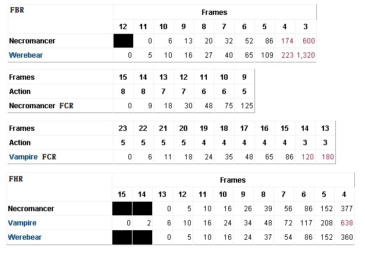
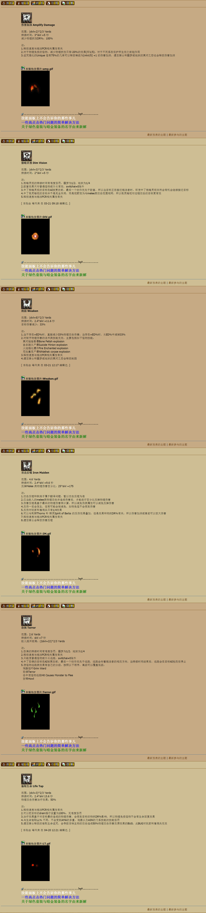
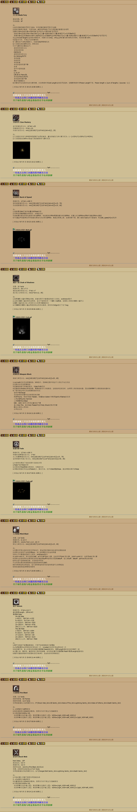
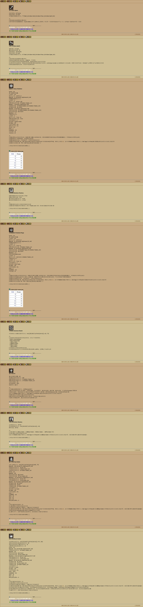
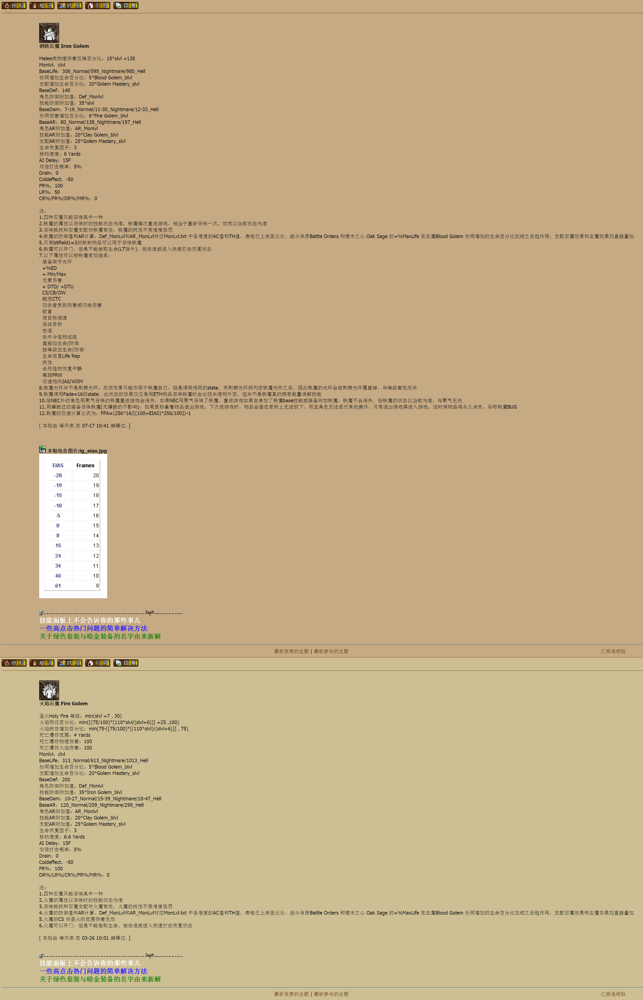

Necromancer
===============================================================================
- 伤害加深 Amplify Damage
- 微暗灵视 Dim Vision
- 削弱 Weaken
- 攻击反噬 Iron Maiden
- 恐惧 Terror
- 偷取生命 Life Tap
- 迷乱 Confuse
- 吸引 Attract
- 衰老 Decrepify
- 降低抵抗 Lower Resist
- 剧毒新星 Poison Nova
- 尸体爆炸 Corpse Explosion
- 白骨装甲 Bone Armor
- 骨墙 Bone Wall
- 骨牢 Bone Prison
- 牙 Teeth
- 骨矛 Bone Spear
- 白骨之魂 Bone Spirit
- 骷髅复生 Raise Skeleton
- 支配骷髅 Skeleton Mastery
- 召唤骷髅法师 Skeletal Mage
- 召唤抵抗 Summon Resist
- 重生 Revive
- 支配石魔 Golem Mastery
- 粘土石魔 Clay Golem
- 鲜血石魔 Blood Golem
- 钢铁石魔 Iron Golem
- 火焰石魔 Fire Golem

slvl  =  skill level 含装备的技能等级

blvl  =  base level 不含装备的投资点数

石魔只能召唤其中一个，使用过程中若人物失去技能点，也要过一段时间才会消失

技能详解
-------------------------------------------------------------------------------

