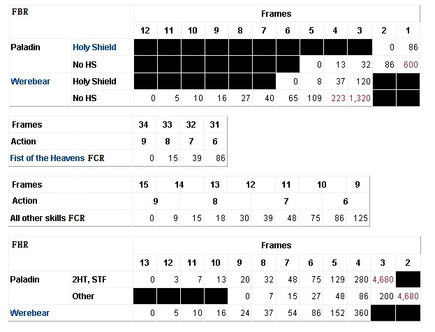
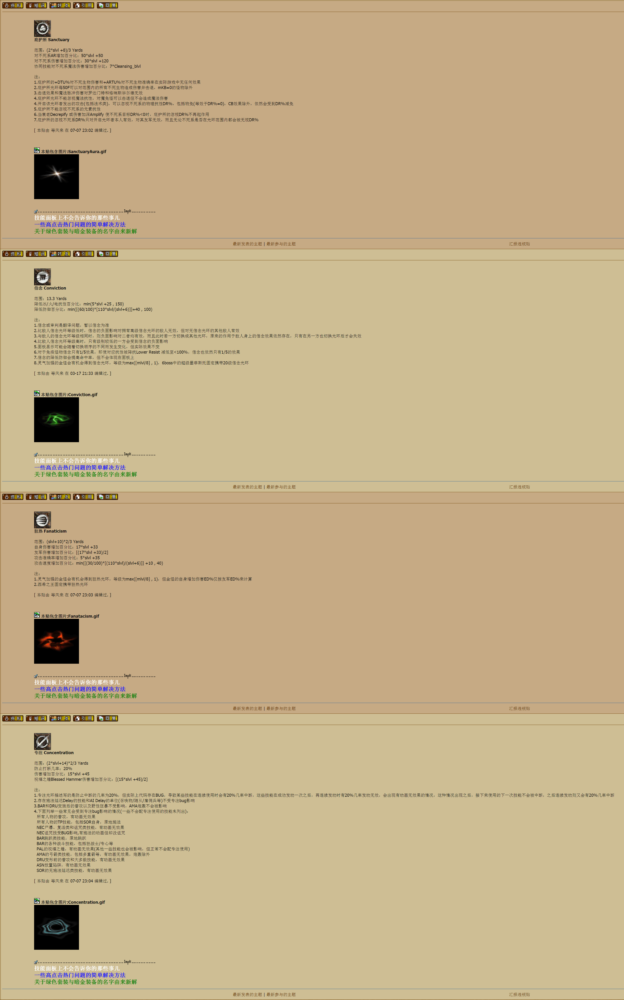
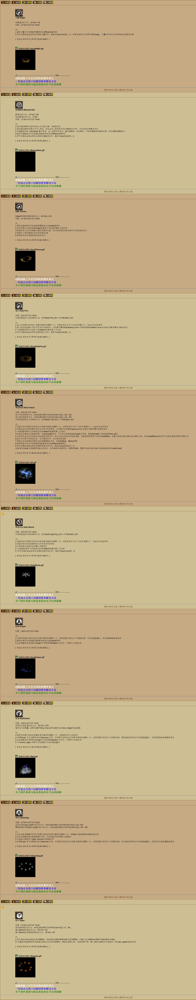
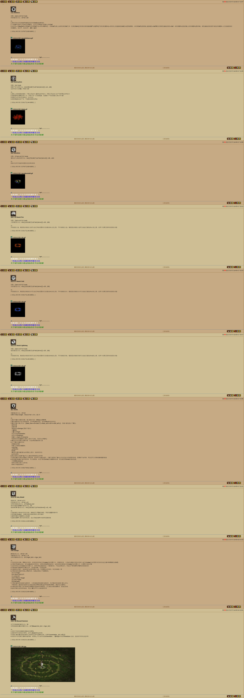
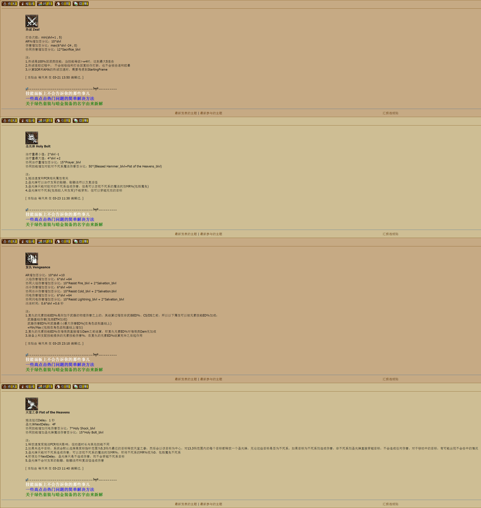

Paladin
===============================================================================
- 庇护所 Sanctuary
- 信念 Conviction
- 狂热 Fanaticism
- 专注 Concentration
- 力量 Might
- 祝福瞄准 Blessed Aim
- 荆棘 Thorns
- 圣火 Holy Fire
- 神圣冰冻 Holy Freeze
- 神圣冲击 Holy Shock
- 祈祷 Prayer
- 冥思 Meditation
- 净化 Cleansing
- 活力 Vigor
- 反抗 Defiance
- 救赎 Redemption
- 救助 Salvation
- 抵抗火焰 Resist Fire
- 抵抗冰冷 Resist Cold
- 抵抗闪电 Resist Lightning
- 重击 Smite
- 神圣护盾 Holy Shield 
- 冲锋 Charge
- 祝福之锤 Blessed Hammer
- 热诚 Zeal
- 圣光弹 Holy Bolt
- 复仇 Vengeance
- 天堂之拳 Fist of the Heavens

slvl  =  skill level 含装备的技能等级

blvl  =  base level 不含装备的投资点数

圣骑士全部光环的预延迟Predelay 均为两秒(50F)，技能注释中不再额外说明

技能详解
-------------------------------------------------------------------------------

