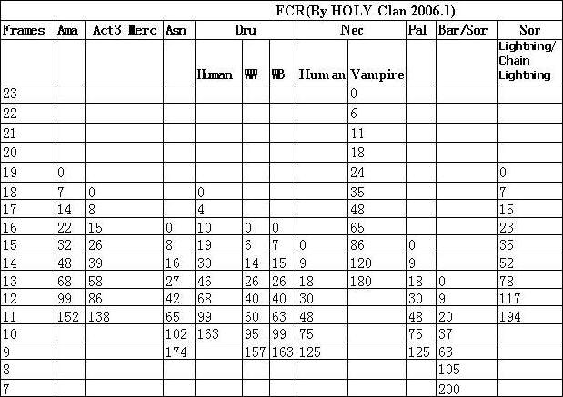
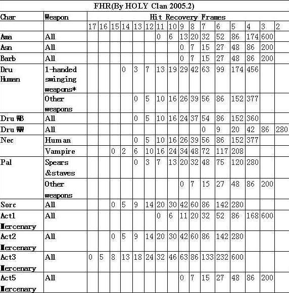
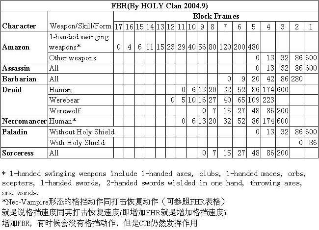

全角色FCR，FHR，FBR表
===============================================================================

术语::

	1-handed swinging weapons                        单手挥击武器
	Ama                           Amazon             亚玛逊
	Asn                           Assassin           刺客
	Bar                           Barbarian          野蛮人
	Block Frames                                     格挡帧数
	Chain Lightning                                  连锁闪电(Sor的电系技能)
	Character                                        角色
	Dru                           Druid              德鲁伊
	FBR                                              快速格挡速度
	FCR                                              快速施法速度
	Form                                             形态
	Frames                                           帧
	HolyShield                                       圣盾(HS)
	Human                                            人型
	Lightning                                        闪电(Sor的电系技能)
	Merc                          Mercenary          雇佣兵
	Nec                           Necromancer        死灵法师
	Pal                           Paladin            圣骑士
	Skill                                            技能
	Sor                           Sorceress          女法师
	Spears                                           长矛
	staves                                           法杖
	Vampire                                          吸血鬼形态(死灵法师穿绿装变身)
	Wb                            Werebear           熊形态(德鲁伊)
	weapon                                           武器
	WW                            Werewolf           狼形态(德鲁伊)